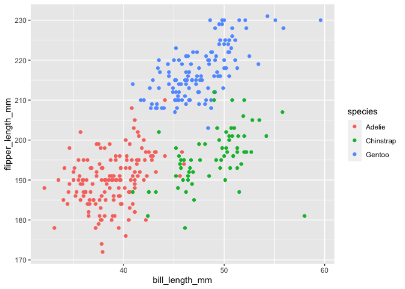

p8105\_hw1\_thb2114
================

# Problem 1

The code chunk below creates a dataframe containing a random sample of
size 10 from a standard Normal distribution and constructs a logical
vector indicating whether the elements of the sample are greater than 0.
It also creates a character vector of length 10 and a factor vector of
length 10 with 3 different factor “levels”.

``` r
problem1_df = tibble(
    sample = rnorm(10),
    gr_than_0 = sample > 0,
    vec_char = c("This","creates","a","character","vector","with","a","length","of","ten"),
    vec_factor = factor(c("low","medium","high","low","medium","high","low","medium","high","low")))
```

I will now try to take the mean of each variable in my dataframe.

``` r
mean(pull(problem1_df,sample))
## [1] -0.3120398
mean(pull(problem1_df,gr_than_0))
## [1] 0.4
mean(pull(problem1_df,vec_char))
## Warning in mean.default(pull(problem1_df, vec_char)): argument is not numeric or
## logical: returning NA
## [1] NA
mean(pull(problem1_df,vec_factor))
## Warning in mean.default(pull(problem1_df, vec_factor)): argument is not numeric
## or logical: returning NA
## [1] NA
```

The character vector and factor variables don’t produce means, but the
logical variable does.

I will now apply the ‘as.numeric’ function to the logical, character,
and vector variables.

``` r
as.numeric(pull(problem1_df,gr_than_0))
as.numeric(pull(problem1_df,vec_char))
as.numeric(pull(problem1_df,vec_factor))
```

The ‘as.numeric’ function turns the logical and factor variables into
numeric variables, but it does not do the same for the character
variable. This further illustrates why a mean could not be calculated
for the character variable. The character variable can not be easily
changed into a number, unlike the logical and factor variables.

# Problem 2

The code chunk below will load the ‘penguins’ dataset from the
‘palmerpenguines’ package, and will provide information about its
contents.

``` r
data("penguins", package = "palmerpenguins")
penguins
names(penguins)
nrow(penguins)
ncol(penguins)
mean(na.omit(pull(penguins,flipper_length_mm)))
mean(na.omit(pull(penguins,bill_length_mm)))
```

The variable names in this dataset include: species, island,
bill\_length\_mm, bill\_depth\_mm, flipper\_length\_mm, body\_mass\_g,
sex, year. The mean flipper length (mm) of the penguins is 200.9152047
and the mean bill length (mm) is 43.9219298. The dataset includes 8
columns and 344 rows.

The following code chunk will create a scatter plot with flipper length
(mm) on the y-axis and bill length (mm) on the x-axis, and will save it
to my project directory.

``` r
ggplot(penguins, aes(x = bill_length_mm, y = flipper_length_mm, color = species)) + geom_point()
## Warning: Removed 2 rows containing missing values (geom_point).
```

<!-- -->

``` r
ggsave("scatter_plot.pdf", height = 4, width = 6)
## Warning: Removed 2 rows containing missing values (geom_point).
```
